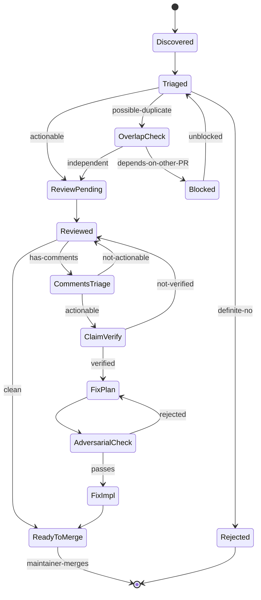
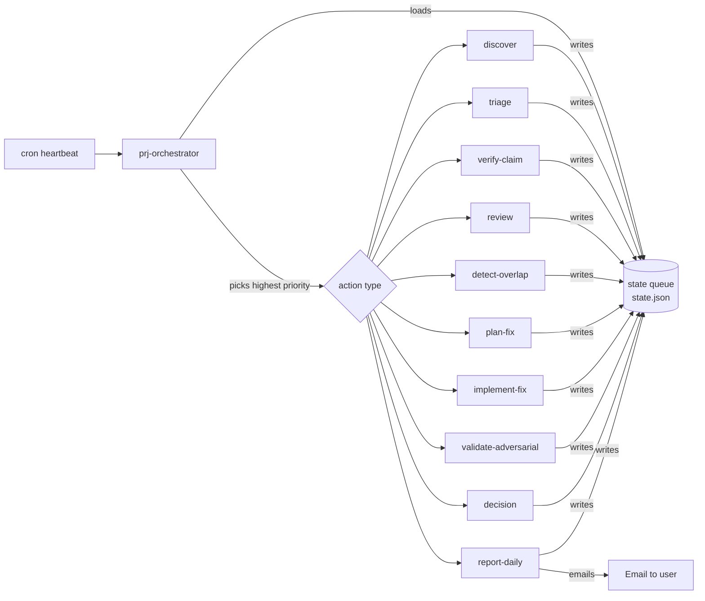

# Module Plan

## Vision

<!-- What this module does, who it's for, and why it matters -->

**Working brief (from user):** A cron-driven workflow that owns the lifecycle of a PR backlog with minimal human touchpoints. One cron cycle maps to one workflow phase. Capabilities include: triage (good vs. definite-no), code review, addressing reviewer comments, finding overlap and marking duplicates, labeling, daily reports, implementing fixes pointed out by comments, generating test plans, and adversarial validation against acceptance criteria. Goal: build trust in autonomous LLM operation by giving it a complete loop with clear hand-off points.

## Architecture

**Decision:** Multi-skill workflow module with state-machine coordination via persistent queue. No agent persona required at v1.

**Skill topology:** Multiple workflow skills, one orchestrator. The orchestrator is the only skill cron invokes directly. All other skills are invoked by the orchestrator based on the highest-priority action in the queue. No skill-to-skill direct calls; coordination always flows through state.

**Why workflow over agent:**

- Each phase action is discrete and procedural, no conversational continuity required.
- Headless cron-invocation maps cleanly to workflow execution semantics.
- Adversarial separation between Verifier/Validator and Implementer is naturally enforced by separate skill invocations with separate prompts and no shared context window. The skeptic cannot accidentally rationalize.
- Easy to test each phase in isolation (each skill is independently invocable).
- An agent persona could wrap output-producing skills later if a unified voice for PR comments and daily reports is desired, but the voice can also live as a tone-of-voice template inside those workflows.

**Per-PR state machine:**

**Heartbeat dispatch flow:**

### Memory Architecture

**Pattern:** No per-skill persistent memory. Shared state queue (data layer) plus per-PR cache and Hindsight long-term knowledge.

- **State queue** at `{project-root}/_bmad-output/pr-workflow/state.json`. Source of truth for "what happens next." Holds in-flight PRs, current phase per PR, next-action priority, blockers, last-run timestamps.
- **Per-PR cache** at `{project-root}/_bmad-output/pr-workflow/prs/{pr-number}/`. Review notes, verification results, fix proposals, decision log. Survives heartbeats so the agent can reference its own prior work.
- **Daily archive** at `{project-root}/_bmad-output/pr-workflow/reports/{YYYY-MM-DD}.md`. Frozen copy of each daily report.
- **Hindsight bank** named `prj` (or per-repo `mcp-server-trello-prj`). Long-term knowledge: project conventions learned, recurring fix patterns, user preferences, "do not do X" rules.
- **No per-skill personal memory.** Each skill loads state at start, writes at end, exits. Stateless invocation.

### Memory Contract

| File or bank | Purpose | Read by | Written by |
| --- | --- | --- | --- |
| `state.json` | Live queue + per-PR phase state | All skills | All skills |
| `prs/{n}/review.md` | Review notes for PR n | review, validate-adversarial, decision, report-daily | review |
| `prs/{n}/verification.md` | Claim verification results | plan-fix, validate-adversarial | verify-claim |
| `prs/{n}/fix-plan.md` | Proposed fix and failing test | implement-fix, validate-adversarial | plan-fix |
| `prs/{n}/decisions.log` | Append-only decision log | decision, report-daily | All decision-making skills |
| `reports/{date}.md` | Daily report archive | (humans, audit) | report-daily |
| Hindsight `prj` bank | Long-term knowledge | All skills | All skills (selective) |

### Cross-Agent Patterns

No agent-to-agent direct calls. All coordination flows through the state queue.

- **Cron** is the only invoker of the orchestrator.
- **Orchestrator** is the only invoker of phase skills.
- **Phase skills** read state, perform their action, write state, exit. They do not invoke each other.
- **Adversarial separation** is structural: `validate-adversarial` runs as a separate invocation with a separate prompt and no shared context with `plan-fix` or `implement-fix`.
- **Reporting** is purely read-only over the state and per-PR archives.

## Skills

**Skill list (proposed, pending user confirmation):**

| # | Skill | Type | Purpose |
| --- | --- | --- | --- |
| 1 | `prj-orchestrator` | workflow | Cron entry. Load queue, pick highest-priority action, dispatch. |
| 2 | `prj-discover` | workflow | Sync GitHub state into queue. Find new PRs and new comments. |
| 3 | `prj-triage` | workflow | Classify PR or comment. Mode parameter switches between PR-triage and comment-triage. |
| 4 | `prj-verify-claim` | workflow | Reproduce alleged bug or push back with a question. |
| 5 | `prj-review` | workflow | Full code review of PR. Notes + confidence + recommendation. |
| 6 | `prj-detect-overlap` | workflow | Find PRs touching same files or concepts. Flag duplicates. |
| 7 | `prj-plan-fix` | workflow | Design fix for verified claim. Write failing test. |
| 8 | `prj-implement-fix` | workflow | Push fix branch, open PR into contributor branch. |
| 9 | `prj-validate-adversarial` | workflow | Adversarial check before any implementation. Gate. |
| 10 | `prj-decision` | workflow | Final PR call: ready-to-merge, request-changes, close-as-not-now. |
| 11 | `prj-report-daily` | workflow | Aggregate state and per-PR archives, send daily email. |

**Resolved consolidation decisions:**

- `prj-triage-pr` + `prj-triage-comment` merged into `prj-triage` with mode parameter.
- `prj-discover` stays separate (different cost profile, own cadence via `prj_discover_every_n`).
- `prj-plan-fix` + `prj-implement-fix` stay separate (adversarial gate sits between them).

**Confirmed assumptions:**

- Single repo at v1 (`mcp-server-trello`). Multi-repo via config in v1.5.
- "Definite no" labels and moves to Rejected state, does NOT auto-close. User closes manually.
- Stale PR re-triage lives inside `prj-discover` as a periodic sweep.
- Adversarial validation runs once per fix-plan. Fail = replan with notes; fail twice = "please advise" hand-off.

### Per-Skill Briefs

Each brief is intentionally self-contained so the BMAD Workflow Builder can be invoked with the brief alone (plus this plan as context) and produce a functional skill. All skills are stateless: they read state at start, write state at end, exit. No persistent in-process memory across invocations.

#### prj-orchestrator

**Type:** workflow

**Purpose:** Cron entry point. Reads queue, picks highest-priority next action, dispatches to the right phase skill, persists state, exits.

**Core Outcome:** A reliable heartbeat that always picks the right next action, never silently fails, and always emits a structured run-log entry.

**Non-Negotiable:** Idempotent. If interrupted mid-run, resuming must not double-act. Per-action transaction boundaries.

**Capabilities:**

| Capability | Outcome | Inputs | Outputs |
| --- | --- | --- | --- |
| Load queue | Current state in memory for this run | `state.json`, last run-log entry | In-memory queue object |
| Select next action | Highest-priority pending action chosen | In-memory queue, `prj_discover_every_n`, `prj_report_hour_local`, current local time | Action descriptor: `{skill, pr_number, mode, priority}` |
| Dispatch to skill | Phase skill executes for one PR | Action descriptor | Skill output, status code |
| Persist state | Updated queue written atomically | Skill output | Updated `state.json` |
| Append run-log | Append-only structured log entry | Run summary | New line in `logs/{YYYY-MM-DD}.jsonl` |
| Trigger discovery cycle | `prj-discover` runs on cadence | Heartbeat counter, `prj_discover_every_n` | Discovery dispatch when counter % N == 0 |
| Trigger daily report | `prj-report-daily` runs once per day | Local hour, `last_report_sent`, `prj_report_hour_local` | Report dispatch when not yet sent today |

**Tool dependencies:** None external. Filesystem only. Calls other skills via subprocess or direct module invocation depending on BMAD harness.

**Activation modes:** Headless cron via `bmad run prj-orchestrator`. CLI debug via `prj-orchestrator --once --dry-run`.

**Memory:** Stateless. Reads `state.json` + last run-log entry. Writes updated `state.json` + new run-log entry.

**Design notes:**

- Priority ordering: (1) `please-advise` PRs always rise unless user-acknowledged via label, (2) PRs with new comments since last triage, (3) older in-flight PRs ahead of newer (FIFO tiebreak), (4) discovery throttled by `prj_discover_every_n`.
- State writes are atomic: write to `state.json.tmp`, fsync, rename. Prevents partial-state corruption on interrupt.
- Run-log line schema: `{ts, run_id, action, pr_number, mode, status, duration_ms, next_action_hint}`.
- The orchestrator NEVER inspects PR content directly. It only reads queue metadata and dispatches.

**Relationships:** Invoked by cron only. Invokes any phase skill. Gates nothing. The single point of authority for phase transitions.

---

#### prj-discover

**Type:** workflow

**Purpose:** Sync GitHub state into the queue. Find new PRs, find new comments, mark stale PRs for re-triage.

**Core Outcome:** Queue accurately reflects all open PRs and their unresolved comment activity, with no silent drops.

**Non-Negotiable:** Every change to the queue is logged. Every PR or comment that disappears is explicitly marked archived, not deleted.

**Capabilities:**

| Capability | Outcome | Inputs | Outputs |
| --- | --- | --- | --- |
| List open PRs | Full set of open PRs in `prj_repo` | `gh pr list --state open --json ...` | PR list |
| Fetch comments per PR | All issue comments + review comments | `gh pr view --json comments,reviews,reviewThreads` | Comment list keyed by PR |
| Diff against queue | New PRs, closed PRs, new comments identified | Current `state.json`, fresh GitHub data | Set of changes |
| Add new entries | New PR enters queue at phase=Discovered | Change set | Updated `state.json`, new `prs/{n}/` directory |
| Update comment counts | Existing PR's comment metadata refreshed | Change set | Updated `state.json` entries |
| Archive closed PRs | PRs no longer open marked archived | Change set | Updated `state.json` (phase=Archived) |
| Flag stale PRs | PRs idle past threshold flagged for re-triage | Last activity timestamps | `needs_retriage: true` flag set |
| Capture diff stats | Files changed and +/- counts per PR | `gh pr diff --stats` | Per-PR cache `meta.json` |

**Tool dependencies:** `gh` CLI authenticated as `prj_bot_user`, `op` for PAT resolution, rate-limit awareness via `gh api rate_limit`.

**Activation modes:** Headless cron (via orchestrator), every `prj_discover_every_n` heartbeats. CLI debug: `prj-discover --once`.

**Memory:** Reads `state.json`. Writes `state.json` + per-PR cache directories. Records last-discover-completed timestamp in run-log.

**Design notes:**

- Rate-limit check before sweep: if remaining < 100, defer to next cycle and log the deferral.
- Stale threshold: 14 days (configurable later).
- Comment detection compares comment IDs, not content hashes. Edited comments not re-triaged at v1 (could change).
- For each new PR, capture contributor login for downstream tone calibration.
- New PRs always start at phase=Discovered. Re-triage flag resets phase to Triaged target on next orchestrator run.

**Relationships:** Invoked by orchestrator on cadence. Output triggers `prj-triage` for new PRs and new actionable comments. Read-only against queue except for additive writes.

---

#### prj-triage

**Type:** workflow

**Purpose:** Classify a PR or a comment via mode parameter.

**Core Outcome:** Every PR and every comment lands in a clear category that determines the next action.

**Non-Negotiable:** Conservative classification. Default to `needs-review` when ambiguous. Never auto-reject without explicit pattern match.

**Capabilities (mode=pr):**

| Capability | Outcome | Inputs | Outputs |
| --- | --- | --- | --- |
| Read PR context | PR title, description, diff stats, contributor history loaded | `state.json`, per-PR cache, `gh` | In-memory PR context |
| Classify PR | Category assigned: actionable / definite-no / possible-duplicate / needs-review | PR context, project conventions from Hindsight bank | Classification record |
| Apply labels | GitHub labels match classification | Classification | `gh pr edit --add-label prj/triage:{class}` |
| Persist classification | Per-PR cache records the call and the rationale | Classification record | `prs/{n}/triage.md` |

**Capabilities (mode=comment):**

| Capability | Outcome | Inputs | Outputs |
| --- | --- | --- | --- |
| Read comment context | Comment text + author role + thread context loaded | `state.json`, per-PR cache, `gh` | In-memory comment context |
| Classify comment | Category assigned: actionable / advisory / noise | Comment context | Classification record |
| Persist classification | Per-PR cache records the call | Classification record | Append to `prs/{n}/comments-triage.md` |
| Trigger downstream | Phase transition queued | Classification | `state.json` phase update (CommentsTriage to ClaimVerify or Reviewed) |

**Tool dependencies:** `gh` for label apply, `op` for PAT, Hindsight bank `prj` for project conventions.

**Activation modes:** Headless cron via orchestrator with `--mode pr|comment` argument. CLI debug supported.

**Memory:** Reads state, per-PR cache, Hindsight bank `prj` (conventions). Writes per-PR cache + state.

**Design notes:**

- PR classification rubric stored as Hindsight memory entry, not hard-coded. Rubric evolves over time without code change.
- Maintainer comments weighted highest in comment-mode. First-timer contributors get extra welcome and patience.
- "Definite-no" requires hitting an explicit pattern list (e.g., changes a deprecated API, contradicts written conventions). Otherwise escalates to `needs-review`.
- Labels: `prj/triage:actionable`, `prj/triage:definite-no`, `prj/triage:duplicate-candidate`, `prj/triage:needs-review`. Maintainer can manually re-label to override; agent respects override on next discover sweep.

**Relationships:** Invoked by orchestrator after `prj-discover`. Output triggers `prj-detect-overlap` (if duplicate-candidate), `prj-review` (if actionable PR), `prj-verify-claim` (if actionable comment). Gates nothing.

---

#### prj-detect-overlap

**Type:** workflow

**Purpose:** Find PRs touching the same files or addressing the same feature space. Flag duplicates and dependencies.

**Core Outcome:** For every PR flagged as a possible duplicate, produce an overlap report with confidence and recommended action (independent / conflicting / complementary / redundant).

**Non-Negotiable:** Compare against ALL other open PRs, not just recent ones. Stale PR overlaps must be detected.

**Capabilities:**

| Capability | Outcome | Inputs | Outputs |
| --- | --- | --- | --- |
| Fetch target diff | Files changed by target PR identified | `gh pr diff --name-only` | File list |
| Compute overlap pairs | All other open PRs scored for file overlap | All open PRs file lists from per-PR caches | Pairs sorted by overlap count |
| Semantic compare | LLM-based comparison of high-overlap diffs | Two diff hunks | Verdict: independent / conflicting / complementary / redundant |
| Apply labels | GitHub labels reflect verdict | Verdict | `prj/overlap:duplicate`, `prj/overlap:conflicts-with-{n}`, `prj/overlap:depends-on-{n}` |
| Produce overlap report | Per-PR cache holds full report | Verdicts | `prs/{n}/overlap.md` |
| Phase transition | Queue reflects verdict | Verdict | `state.json` (OverlapCheck to ReviewPending or Blocked) |

**Tool dependencies:** `gh pr diff`, `op`. Internal LLM invocation for semantic compare.

**Activation modes:** Headless cron via orchestrator. CLI debug supported.

**Memory:** Reads state + all per-PR caches (file lists). Writes target PR's cache + state.

**Design notes:**

- File overlap threshold: any 2+ shared files trigger semantic comparison.
- Semantic compare prompt asks for one of four verdicts and a one-paragraph rationale.
- Conflicting pairs: newer PR moves to Blocked until older is decided.
- Complementary pairs: flagged as "merge older first" recommendation in daily report.
- Redundant pairs: trigger `definite-no` re-classification of newer PR with link to older.
- First test case in current backlog: PR #82 (refactor attachments) vs PR #81 (generic attach_data tool). Likely complementary or conflicting.

**Relationships:** Invoked by orchestrator after `prj-triage` flags possible-duplicate. Output triggers `prj-review` (independent or complementary) or skips review (redundant) or blocks (conflicting). Gates nothing downstream beyond the Blocked phase.

---

#### prj-review

**Type:** workflow

**Purpose:** Full code review of a PR.

**Core Outcome:** A structured review document with findings, severity, suggested fixes, citations to specific files and line numbers, and an overall confidence score.

**Non-Negotiable:** Cite specific files and line numbers for every finding. No hand-wavy structural opinions without anchors.

**Capabilities:**

| Capability | Outcome | Inputs | Outputs |
| --- | --- | --- | --- |
| Fetch PR diff and files | Full diff + changed files in scope | `gh pr diff`, `gh pr view` | Diff + file content |
| Apply review heuristics | Findings produced across correctness, edge cases, error handling, test coverage, style | Diff + project conventions from Hindsight bank | List of findings with severity |
| Cross-reference conventions | Findings checked against project CLAUDE.md and Hindsight `prj` bank | Findings, conventions | Conventions-aware finding annotations |
| Score each finding | Severity assigned: blocker / major / minor / nit | Findings | Severity-tagged findings |
| Self-check pass | Re-read findings critically, drop weak ones | Findings | Confidence-filtered findings |
| Produce review document | `prs/{n}/review.md` exists with structured findings | Findings | Per-PR cache file |
| Optionally post review | GitHub PR Review (Comment-type, not Approve/Request-Changes) posted | Review document | `gh pr review --comment --body-file` |

**Tool dependencies:** `gh`, `op`, Hindsight bank `prj`.

**Activation modes:** Headless cron via orchestrator. CLI debug.

**Memory:** Reads state, per-PR cache, project conventions from Hindsight. Writes review.md to per-PR cache. Optionally writes back to Hindsight when patterns repeat (e.g., "this contributor consistently misses error handling").

**Design notes:**

- Findings schema: `{ file, line, severity, category, claim, suggested_fix }`. Strict.
- Hierarchy applied: contract (PR description + AC) > project conventions > tests > style.
- Self-check pass: agent re-reads each finding from a critical persona and drops findings that don't survive. Reduces noise.
- If review surfaces a critical issue NO comment captures, can route to `prj-verify-claim` as if it were a comment-claim. This is the implicit "agent finds an unflagged bug" path.
- `prj_post_review_comment` config (default false at v1, cache-only) controls whether to post on GitHub. Flip to true once trust ramps after observing a clean Phase B+C run.

**Relationships:** Invoked by orchestrator after `prj-triage` marks actionable AND `prj-detect-overlap` clears (independent or complementary). Output feeds `prj-decision` and `prj-report-daily`. Can also feed `prj-verify-claim`.

---

#### prj-verify-claim

**Type:** workflow

**Purpose:** Reproduce an alleged bug or push back with a question. The skeptic's first check.

**Core Outcome:** Every claim either reproduces (becomes actionable for fix-planning) or is rejected with a clear, polite question posted on the PR.

**Non-Negotiable:** Treat absence of reproduction as informative. If a claimed bug cannot be reproduced, the agent does NOT silently move on. It posts a clarifying question and parks the claim.

**Capabilities:**

| Capability | Outcome | Inputs | Outputs |
| --- | --- | --- | --- |
| Read claim | Claim text + context loaded | Per-PR cache `comments-triage.md` | In-memory claim |
| Determine strategy | Reproduction approach decided: failing test, existing test run, manual exercise | Claim + repo structure | Strategy plan |
| Provision worktree | PR branch checked out into isolated worktree | `gh pr checkout` into `_bmad-output/pr-workflow/worktrees/{n}/` | Worktree path |
| Execute reproduction | Strategy runs, observation captured | Worktree, strategy, `prj_test_runner` | Observation log |
| Determine verdict | One of: verified / not-verified / ambiguous | Observation log | Verdict + rationale |
| Post comment (if not-verified) | Polite question on PR thread | Verdict, observation | `gh pr comment` |
| Persist verification | Per-PR cache records strategy, observation, verdict | Verdict | `prs/{n}/verification.md` |
| Phase transition | Queue advances per verdict | Verdict | `state.json` (ClaimVerify to FixPlan / Reviewed / PleaseAdvise) |

**Tool dependencies:** `gh` (PR checkout, post comment), Git (worktree management), `prj_test_runner`, `op` for PAT.

**Activation modes:** Headless cron via orchestrator. CLI debug supported.

**Memory:** Reads claim from per-PR cache. Writes verification.md to per-PR cache. Worktrees are ephemeral, cleaned after run unless verification fails for inspection.

**Design notes:**

- Worktrees live under `_bmad-output/pr-workflow/worktrees/{n}/`. Cleaned on successful verification, retained on failure for human inspection.
- The verifier is structurally separate from `prj-plan-fix`. They never share invocation context. Prevents the "I planned the fix so I'll rationalize the verification" failure.
- "Please advise" entries surface in the daily report's "needs your eyes" shortlist.
- Tone of pushback comments: polite, curious, never accusatory. Tone guide stored in module memory under `assets/tone-pushback.md`.
- If reproduction reveals the claim is correct but the bug is in code OUTSIDE the PR's scope, log this and route the original PR back to `Reviewed` while opening a separate issue note in `state.json`.

**Relationships:** Invoked by orchestrator after `prj-triage` marks comment as actionable. Output triggers `prj-plan-fix` (verified), reverts to Reviewed (not-verified), or PleaseAdvise (ambiguous). Gates `prj-plan-fix` and `prj-implement-fix`.

---

#### prj-plan-fix

**Type:** workflow

**Purpose:** For a verified actionable claim, design the fix and write a failing test that demonstrates the bug.

**Core Outcome:** A fix-plan document containing (a) the failing test, (b) the proposed diff, (c) why this is the right fix, (d) what could go wrong.

**Non-Negotiable:** Failing test first. If a failing test cannot be written, the bug is not well-defined and the fix does not advance.

**Capabilities:**

| Capability | Outcome | Inputs | Outputs |
| --- | --- | --- | --- |
| Read verification | Verified claim + observation in scope | Per-PR cache `verification.md` | Claim context |
| Design failing test | Test that captures the bug's behavior | Claim, repo test patterns | Test code |
| Run test | Test fails as expected, demonstrating bug | Worktree, test code, `prj_test_runner` | Run output (must be FAIL) |
| Design fix | Smallest diff that makes the test pass | Test, repo code | Diff |
| Run fix + test | Test passes after fix; full suite shows no regressions | Worktree, diff, `prj_test_runner` | Run output (must be PASS for new test, no regressions) |
| Articulate rationale | Why this fix is correct, with conventions cited | Diff, project conventions from Hindsight | Rationale text |
| Articulate risks | What could go wrong, side effects, scope concerns | Diff | Risk text |
| Persist plan | Fix-plan document complete | All above | `prs/{n}/fix-plan.md` |
| Phase transition | AdversarialCheck queued | Plan complete | `state.json` (FixPlan to AdversarialCheck) |

**Tool dependencies:** Git (worktree), `prj_test_runner`, `op`. No GitHub writes from this skill.

**Activation modes:** Headless cron via orchestrator. CLI debug supported.

**Memory:** Reads verification + project conventions. Writes fix-plan.md. Selectively reads Hindsight for prior similar fixes; does NOT write to Hindsight (validate-adversarial owns rejection learning).

**Design notes:**

- Failing test is the contract for the fix. `prj-validate-adversarial` will check that the test actually demonstrates the alleged bug, not merely the proposed fix.
- Fix-plan must include "what could go wrong" section. Forces enumeration of risks.
- If fix touches multiple files, plan justifies each file change separately.
- If validate-adversarial rejects, plan-fix gets a redo with failure notes appended. After two failed attempts, escalate to PleaseAdvise.
- Plan-fix does NOT write to GitHub. Comments and PRs are the implement-fix skill's job.

**Relationships:** Invoked by orchestrator after `prj-verify-claim` returns verified. Output triggers `prj-validate-adversarial`. Gated by `prj-verify-claim`. Gates `prj-implement-fix`.

---

#### prj-validate-adversarial

**Type:** workflow

**Purpose:** Adversarial review of a fix-plan. Challenge premise, scope, side effects, and behavior change.

**Core Outcome:** Verdict (passes / rejected / escalate) plus structured concerns. Implementation only proceeds on pass.

**Non-Negotiable:** Run with no shared invocation context with `prj-plan-fix`. Adversarial prompt written from a skeptical persona. Default verdict is reject; the plan must affirmatively pass a checklist.

**Capabilities:**

| Capability | Outcome | Inputs | Outputs |
| --- | --- | --- | --- |
| Re-read failing test critically | Test demonstrates the alleged bug, not just the agent's interpretation | Verification + fix-plan + test code | Test-validity finding |
| Re-read proposed diff | Diff scope is minimal; nothing beyond the bug fixed | Fix-plan diff | Scope-validity finding |
| Check side effects | Shared utilities, public APIs, configs not unintentionally affected | Diff + repo dependency graph | Side-effect finding |
| Run regression suite | No existing tests broken by fix | Worktree, full test suite, `prj_test_runner` | Regression report |
| Check AC alignment | Fix aligns with PR's stated acceptance criteria, not just the comment | PR description, AC, fix-plan | AC alignment finding |
| Worst-case probe | What happens if we DON'T apply the fix? Is the bug actually load-bearing? | Claim + codebase | Probe finding |
| Verdict | One of: pass / reject / escalate | All findings | Verdict + structured concerns |
| Persist | Per-PR cache holds the adversarial report | Verdict | `prs/{n}/adversarial.md` |
| Phase transition | Queue advances per verdict | Verdict | `state.json` (AdversarialCheck to FixImpl / FixPlan / PleaseAdvise) |

**Tool dependencies:** `prj_test_runner`, Git (worktree), no GitHub writes.

**Activation modes:** Headless cron via orchestrator. CLI debug supported.

**Memory:** Reads fix-plan + verification + review + project conventions. Writes adversarial.md. Writes to Hindsight bank `prj` when a reject pattern repeats (e.g., "agent keeps proposing fixes that touch the cache layer; flag for human review").

**Design notes:**

- THE worst-case guard rail. Treat suspicion as default mental mode.
- Regression suite run is mandatory: any test that previously passed now failing = automatic reject.
- Adversarial prompt stored as module asset `assets/prompt-adversarial.md`. Reviewed periodically as part of trust calibration.
- Verdict must include explicit reasoning. "I don't like it" is not enough.
- Two consecutive rejects on the same plan = escalate to PleaseAdvise. Prevents infinite re-plan loops.
- If validate-adversarial discovers a flaw the original review missed, that flaw is logged in `prs/{n}/review.md` retroactively (with adversarial as source).

**Relationships:** Invoked by orchestrator after `prj-plan-fix`. Output triggers `prj-implement-fix` (pass), `prj-plan-fix` redo (reject), or PleaseAdvise (escalate). Gates `prj-implement-fix`.

---

#### prj-implement-fix

**Type:** workflow

**Purpose:** Apply the fix. Push to a branch, open a fix-PR into the contributor's branch.

**Core Outcome:** A fix-PR exists targeting the contributor's branch, with a clean commit, a clear description, and the failing-test-now-passing as proof.

**Non-Negotiable:** Never push directly to the contributor's branch. Never force-push. Every change is a new commit; every fix is a new PR.

**Capabilities:**

| Capability | Outcome | Inputs | Outputs |
| --- | --- | --- | --- |
| Read pass verdict | Plan + verdict loaded | `fix-plan.md`, `adversarial.md` (must be pass) | Plan context |
| Provision branch | New branch created on this repo or fork | Git, `prj_bot_user` | Branch `prj/auto-fix/{n}-{slug}` |
| Apply diff | Fix code applied | Worktree + plan diff | Modified worktree |
| Run failing test | Test passes after fix | `prj_test_runner` | PASS result |
| Run full suite | No regressions | `prj_test_runner` | PASS for whole suite |
| Commit | Clean commit with attribution | Worktree, commit message template | Git commit |
| Push branch | Branch pushed to GitHub | Git, `op` for PAT | Pushed branch |
| Open fix-PR | PR created targeting contributor's branch | `gh pr create` | Fix-PR URL |
| Apply label to original PR | `prj/fix-proposed` label on original | `gh pr edit --add-label` | Label set |
| Persist implementation record | Cache holds PR URL, commits, run output | All above | `prs/{n}/implementation.md` |
| Phase transition | ReadyToMerge queued | All above | `state.json` (FixImpl to ReadyToMerge) |

**Tool dependencies:** Git, `gh`, `op`. Project test runner.

**Activation modes:** Headless cron via orchestrator. CLI debug.

**Memory:** Reads fix-plan + adversarial verdict. Writes implementation.md. Records contributor close/merge response in Hindsight after observation.

**Design notes:**

- Fix-PR title format: `[prj] {short summary} (re #{original PR number})`.
- Fix-PR body template stored as module asset `assets/template-fix-pr.md`.
- If `gh pr create` fails (target branch protected, contributor doesn't accept PRs), fall back to posting fix-plan as a comment on the original PR with the diff in a fenced code block. This is Tier 1 fallback within the Tier 2 default.
- Commit messages use conventional commit style. Co-authored-by header includes the original commenter or maintainer when applicable.
- After fix-PR is opened, watch contributor response. If closed without merging, parse close comment for reason, log to Hindsight bank `prj` for pattern learning.

**Relationships:** Invoked by orchestrator after `prj-validate-adversarial` passes. Gated by adversarial pass. Output feeds `prj-decision` (PR moves to ReadyToMerge after fix-PR opens).

---

#### prj-decision

**Type:** workflow

**Purpose:** Make the final call on a PR: ready-to-merge, request-changes, or close-as-not-now.

**Core Outcome:** A clear, defensible decision label plus a comment summarizing the reasoning, written from full per-PR cache evidence.

**Non-Negotiable:** Decision must be defensible from the per-PR cache contents alone. No "vibes" decisions.

**Capabilities:**

| Capability | Outcome | Inputs | Outputs |
| --- | --- | --- | --- |
| Aggregate cache | All artifacts loaded | Per-PR cache (review, verification, fix-plan, adversarial, implementation, overlap, decisions log) | Full PR picture |
| Apply rubric | Decision class determined | Rubric + PR picture | Class: ready-to-merge / request-changes / close-as-not-now |
| Apply GitHub label | Decision label applied | `gh pr edit --add-label` | Label set |
| Post summary comment | Reasoning posted on PR | Decision template + PR picture | `gh pr comment` |
| Append decision log | Per-PR decisions log appended | Decision | `prs/{n}/decisions.log` |
| Phase transition | Terminal phase or revert | Decision | `state.json` (Reviewed to ReadyToMerge or back to Reviewed) |

**Tool dependencies:** `gh`, `op`.

**Activation modes:** Headless cron via orchestrator. CLI debug.

**Memory:** Reads full per-PR cache. Writes decisions.log + state. Writes maintainer-override observations to Hindsight (e.g., "I overrode this decision; here's why").

**Design notes:**

- Decision is reversible: maintainer override label always wins. Agent re-reads on next discover sweep and respects override.
- "Close-as-not-now" requires (a) no maintainer activity in >30 days, (b) one of: definite-no triage, overlap redundant, or two adversarial-validation escalations. Conservative gate.
- Decision comment uses structured template: "Summary, Findings, Outstanding items, Recommendation." Stored as module asset `assets/template-decision-comment.md`.
- Decision applies at most once per PR per state-machine pass. Prevents thrash.
- Labels: `prj/decision:ready-to-merge`, `prj/decision:request-changes`, `prj/decision:close-as-not-now`.

**Relationships:** Invoked by orchestrator after `prj-review` and (optionally) `prj-implement-fix` complete. Output: terminal label and PR comment. Gates nothing downstream beyond re-triage on author updates.

---

#### prj-report-daily

**Type:** workflow

**Purpose:** Aggregate state and per-PR archives. Send daily email at `prj_report_hour_local`.

**Core Outcome:** A single email lands at `prj_email_to` summarizing what changed in the last 24h and what needs the user's attention.

**Non-Negotiable:** "Needs your eyes" shortlist is at the top. PleaseAdvise entries lead. No buried critical items.

**Capabilities:**

| Capability | Outcome | Inputs | Outputs |
| --- | --- | --- | --- |
| Load full picture | All state + per-PR caches + run-log loaded | `state.json`, all `prs/{n}/`, run-log | In-memory aggregate |
| Group by status | Sections built: needs-attention, in-progress, resolved-today, no-change | Aggregate | Grouped data |
| Build "needs your eyes" shortlist | Top 5 most urgent items selected | Grouped data, priority logic | Shortlist (max 5) |
| Render HTML email | Email body composed with inline CSS | Grouped data + shortlist + template | HTML body + plain-text fallback |
| Resolve SMTP creds | User and pass loaded from 1Password | `prj_smtp_creds_ref`, `op` | SMTP creds |
| Send via SMTP | Email delivered | SMTP creds + body + recipient | Delivery confirmation |
| Archive | Email body saved to file | Body | `reports/{YYYY-MM-DD}.md` |
| Update last-sent | State records timestamp | Send confirmation | `state.json` `last_report_sent` |

**Tool dependencies:** Python `smtplib`, `op`. No GitHub access required (read-only over local cache).

**Activation modes:** Headless cron via orchestrator (triggered when local hour matches `prj_report_hour_local` AND not yet sent today). CLI debug: `prj-report-daily --dry-run` writes to local file without sending.

**Memory:** Reads state + all per-PR caches + run-log. Writes archive file + state.json `last_report_sent`. Does not touch Hindsight.

**Design notes:**

- Email subject: `[PR Jangler] {date}: {n} need attention, {m} in progress`.
- HTML uses inline CSS only. External-asset-free. Plain-text fallback always included.
- "Needs your eyes" cap at 5; overflow noted as "+ {n} more, see archive".
- If no in-flight PRs and no actions in 24h, send a brief "all quiet" email rather than skipping. Confirms the bot is alive.
- Daily archive is append-only. Doubles as audit trail.
- Failure mode: SMTP failure logs to run-log and retries on next heartbeat (with backoff). After 3 failures, escalate to PleaseAdvise on a synthetic "system" PR entry.

**Relationships:** Invoked by orchestrator at the configured hour. Gates nothing. Output: email + archive.

## Configuration

Module-level config variables collected by `prj-setup` skill. Stored in `_bmad/config.toml` under `[modules.prj]` and resolved at runtime. Sensitive values stored as 1Password references and resolved via `op read` at invocation.

| Variable | Prompt | Default | Required | Result Template | User Setting |
| --- | --- | --- | --- | --- | --- |
| `prj_repo` | "Which GitHub repo should PR Jangler watch? (owner/name)" | (required) | yes | `prj_repo = "{value}"` | yes |
| `prj_bot_user` | "GitHub bot account login that opens fix-PRs" | (required) | yes | `prj_bot_user = "{value}"` | yes |
| `prj_bot_token_ref` | "1Password reference for the bot's GitHub PAT" | `op://DeLoSecrets/prj-bot-token/credential` | yes | `prj_bot_token_ref = "{value}"` | yes |
| `prj_email_to` | "Where should daily reports go?" | `jaradd@gmail.com` | yes | `prj_email_to = "{value}"` | yes |
| `prj_email_from` | "Sender address for daily reports" | `pr-jangler@delo.sh` | yes | `prj_email_from = "{value}"` | yes |
| `prj_smtp_host` | "SMTP host" | `smtp.gmail.com` | yes | `prj_smtp_host = "{value}"` | yes |
| `prj_smtp_port` | "SMTP port" | `587` | yes | `prj_smtp_port = {value}` | yes |
| `prj_smtp_creds_ref` | "1Password reference for SMTP user/pass" | `op://DeLoSecrets/gmail-smtp` | yes | `prj_smtp_creds_ref = "{value}"` | yes |
| `prj_confidence_threshold` | "Minimum confidence (0-1) to open a fix-PR" | `0.85` | no | `prj_confidence_threshold = {value}` | no |
| `prj_heartbeat_minutes` | "Cron heartbeat interval in minutes" | `15` | no | `prj_heartbeat_minutes = {value}` | no |
| `prj_discover_every_n` | "Run prj-discover every N heartbeats" | `3` | no | `prj_discover_every_n = {value}` | no |
| `prj_report_hour_local` | "Local hour to send daily report (0-23)" | `8` | no | `prj_report_hour_local = {value}` | no |
| `prj_test_runner` | "Override repo's test runner command" | (auto-detect) | no | `prj_test_runner = "{value}"` | no |
| `prj_post_review_comment` | "Post review summary as a GitHub PR comment? (false = cache only)" | `false` | no | `prj_post_review_comment = {value}` | no |
| `prj_bot_email` | "Email address for the bot's Git commits (used in Author: header)" | `{prj_bot_user}@users.noreply.github.com` | no | `prj_bot_email = "{value}"` | no |
| `prj_maintainer_logins` | "GitHub logins to weight as maintainers (for triage + close-as-not-now gating)" | `[]` | no | `prj_maintainer_logins = ["{value}"]` | yes |

## External Dependencies

| Dependency | Purpose | Used by | Setup skill check |
| --- | --- | --- | --- |
| `gh` (GitHub CLI) | PR + comment access, label application | discover, triage, review, detect-overlap, decision, implement-fix | Verify installed and authenticated as `prj_bot_user` |
| `op` (1Password CLI) | Resolve credential references at runtime | All skills that touch credentials | Verify installed and signed in |
| Git CLI | Branch creation, commits, push | implement-fix, plan-fix | Verify installed |
| Python 3.12+ via `uv` | Skill runtime | All skills | Verify `uv` installed; pin Python version |
| Repo's native test runner | Run failing-test gate, regression checks | plan-fix, validate-adversarial | Auto-detect (`bun`, `npm`, `pytest`, `cargo`); accept `prj_test_runner` override |
| Python `smtplib` | Send daily email | report-daily | Standard library, no install needed |

## UI and Visualization

**v1 surface:** HTML-formatted daily email. Sections per PR with links back to GitHub and to per-PR cache files. Top-of-email "needs your eyes" shortlist for any PR blocked on user input.

**v1.5 future:** Small FastAPI + HTMX dashboard at `https://prj.delo.sh` showing live queue state, per-PR phase, last-action timestamps, and the orchestrator's next-action queue. Punted from v1 to keep surface area small.

**Per-skill HTML reports:** None at v1. Daily email aggregates everything. Could add per-PR HTML review reports if email becomes too dense.

## Setup Extensions

The setup skill (`prj-setup`) does more than collect config:

- Validate `gh` is installed and authenticated as the configured `prj_bot_user`. Fail setup if mismatched.
- Validate `op` is installed and signed in. Test resolution of `prj_bot_token_ref` and `prj_smtp_creds_ref` (read both, do not log values).
- Send a "PR Jangler online" test email via SMTP. Setup does not complete unless this email succeeds.
- Create directory structure under `{project-root}/_bmad-output/pr-workflow/`:
  - `state.json` (initialized empty)
  - `prs/` (per-PR cache root)
  - `reports/` (daily report archive)
  - `logs/` (structured run logs)
- Generate a sample cron entry (using `prj_heartbeat_minutes`) and print it for manual install.
- Print the consent banner template (sticky issue or README banner) for the user to post manually.
- Initialize Hindsight bank `prj` if not already present.

## Integration

**Standalone module.** No parent module dependency. Repo-agnostic by design.

**Cross-system relationships:**

- Hindsight bank `prj` for long-term knowledge (project conventions, recurring fix patterns, user preferences).
- 1Password vault `DeLoSecrets` for credential resolution.
- The repo's own test runner is treated as an opaque dependency (auto-detected, override per-config).
- Optionally consumes `bmad-bmm-code-review` skill if installed (delegate review heuristics) but does not require it.

**Multi-repo path (v1.5):** `prj_repo` becomes `prj_repos: [list]`. State queue partitions by repo. Per-PR cache nests under `prs/{repo-slug}/{pr-number}/`. No structural changes required to skill design.

## Creative Use Cases

Discovered during brainstorming, captured for later consideration:

- **Stale PR rescue.** Periodic sweep over PRs whose authors have gone quiet. Surface ones that just need a rebase or a small fix. Could be an autonomous fix-PR or a "please advise" entry.
- **Pattern learning.** Hindsight memory accumulates rejection patterns over time. After enough data, agent pre-rejects PRs matching the pattern at triage rather than putting them through full review.
- **Author profile.** Per-contributor tone and confidence calibration. Maintainer comments weighted higher than first-time contributors. Adjust review depth accordingly.
- **Cross-PR fix propagation.** When a fix is generally useful (e.g., an off-by-one in a shared utility), agent surfaces "this fix may also apply to PR #X, #Y" in the daily report.
- **Conflict resolution suggester.** For overlapping PRs, agent proposes a merge ordering and the rebase deltas. User decides whether to push.
- **Onboarding friction reducer.** First-PR-from-contributor gets extra patience: agent posts a welcoming "thanks for contributing, here's how the project's conventions work" comment with concrete fix proposals.

## Ideas Captured

### Initial Spark

- **Domain:** Open-source repo PR backlog (this repo: `mcp-server-trello`, currently 13 open PRs across features, bugfixes, refactors, and chore PRs).
- **Goal:** Maximize LLM autonomy across the full PR lifecycle. The user wants to ratchet trust in the LLM by handing it a complete loop, not a one-shot reviewer.
- **Operating model:** Cron-driven. One cron cycle = one workflow phase. Phases progress without continuous human prompting.
- **Capabilities the user listed:**
  - Triage: which PRs look good, which are definite-no
  - Code review
  - Address comments (read reviewer feedback, respond, act)
  - Detect overlap, mark duplicates, apply labels
  - Daily reports back to the user
  - Implement fixes that comments point out (write code, not just suggest)
  - Generate test plans
  - Validate against acceptance criteria from an adversarial viewpoint

### Observations from Repo State (2026-05-09)

- 13 open PRs. Likely overlap pair: PR #82 (refactor attachments domain) vs PR #81 (generic attach_data_to_card). Both touch attachments, one restructures, one adds a new tool. Either they merge cleanly in sequence or they are in conflict.
- PRs are heterogeneous: features (custom fields, name filter, copy_card, intelligent caching), bug fixes (truncate descriptions), workspace config (TRELLO_ALLOWED_WORKSPACES), README patches, and one WIP draft (bun version-bump script).
- Heterogeneity matters: triage rules cannot be uniform. A README typo PR has different acceptance bar than a caching layer PR.

### Open Threads to Explore

- Is Trello the workflow's state machine? Each PR becomes a card; lists represent phases (Triage, Review, Comment-Address, Implement, Test, Decision). Dogfood angle: this module would *use* the trello MCP server it lives in.
- Cron rhythm: one cycle advances all in-flight cards by one phase, or one cycle = one whole-board sweep through one phase?
- "Implement fixes" autonomy levels: propose a diff in a comment, push to a fix branch, push directly to the PR's branch (with author permissions), or open a follow-up PR?
- Trust ramp: graduated autonomy. Starts in "propose only" mode, ratchets up as the user approves more.
- Daily report channel: Trello card, markdown file in the repo, hindsight memory write, email, none-of-the-above.
- Adversarial test plan generator: should it actively try to break the change, propose breaking inputs, hunt for unhandled edge cases?

### Phase 1 Round 1: User Answers and Recommendations

**Locked:**

- **(Q1) Domain-agnostic.** Module operates on any repo's PR backlog. The mcp-server-trello repo is just the initial test rig. No coupling to Trello.
- **(Q4) Email v1** to `jaradd@gmail.com`. Spec a `Reporter` interface so Telegram, Slack, and other channels become drop-in implementations later.

**Tentative (pending user confirmation):**

- **(Q2) Cron rhythm.** Fixed-interval heartbeat (every 10-15 min) reading a persistent state queue at `_bmad-output/pr-workflow/state.json`. Each heartbeat loads the queue, executes one state transition for the highest-priority PR, updates the queue, exits. The agent expresses urgency through queue priority, not by writing new cron entries. Rationale: avoids the stall-failure mode of agent-driven scheduling, aligns with event-driven architecture (cron = timer, queue = bus). Confirms user instinct of "1 run = 1 transition" while replacing chained-cron mechanism with a heartbeat+queue.
- **(Q3) Fix implementation v1.** Agent pushes to a unique branch on this repo and opens a PR INTO the contributor's branch. Reversible (PR not force-push), transparent (all actions in GitHub UI), consent-respecting (author retains branch autonomy), audit-clean (commits signed under bot identity). Future trust ladder: direct push when "Allow edits from maintainers" is enabled, then maintainer-owned `fix/auto-{n}` branches for triage-confirmed definite-yes PRs.

**Pre-launch communication:** Sticky issue or README banner announcing the automated PR Jangler bot. Establishes consent before surprise.

### Phase 6 Resolutions (2026-05-09)

User confirmed by saying "continue" without redirecting. Default recommendations applied:

1. **Triage rubric warm start: yes.** Initial rubric seeded for `mcp-server-trello` in the appendix at the end of this plan. Hindsight bank `prj` accumulates refinements over time.
2. **`prj_post_review_comment` default: false.** Cache-only at v1. Flip to true after observing one clean Phase B+C cycle.
3. **Adversarial checklist: 6 items stand.** No additions or removals. Re-evaluate after first 10 fix-PR opens.
4. **Implement-fix attribution: keep `Co-Authored-By`.** Distributes credit, preserves audit clarity, respects social fabric of contribution.
5. **Close-as-not-now gate: stand.** 30 days no maintainer activity AND (definite-no OR overlap-redundant OR 2 adversarial escalations). Conservative. Reversible via maintainer override label.
6. **All-quiet daily email: send.** Brief liveness confirmation when no actions occurred. Subject: `[PR Jangler] {date}: all quiet`.

**Cross-cutting gaps deferred:**

- **Merge automation:** cut at v1. User retains final merge authority.
- **Config drift detector:** deferred to v1.5. Triggered when CLAUDE.md or project conventions change.
- **Author-feedback ingestion:** partially captured in `prj-implement-fix` design notes. Expand to its own skill if richer learning is warranted after first month.

### Phase 1 Round 2: Worst-Case Failure Mode and Guard Rails

**The worst case (from user):** A commenter calls out a request or bug that is not actually a bug, or whose suggested fix is wrong. The agent acts on the comment, breaking working code or changing behavior in undesired ways.

This is THE central design constraint, not an edge case. Treating comments as authoritative is exactly how a confident agent breaks correct code. It directly shapes the architecture.

**Guard rails the worst case requires:**

1. **Claim verification before action.** Any comment demanding a change must pass a reproduction step. Agent must reproduce the failure before treating it as a bug. If reproduction fails, agent posts: "I tried to reproduce this, here is what I saw, can you clarify?" and does not implement.

2. **Source-of-truth hierarchy.** Comments rank below the contract. Order:
   1. PR description and stated acceptance criteria (the contract)
   2. Project conventions and existing test suite (the ground)
   3. Maintainer comments (highest-weighted human voice)
   4. Other contributor comments (advisory only)
   5. Linked issues (context)

   Conflicts between layers raise a flag, never trigger an implementation.

3. **Failing-test-first gate.** Before any fix-PR opens, the agent writes a failing test that demonstrates the bug, then the fix, then proves the test passes and no other tests regress. Cannot write a failing test? Bug is not well-defined, fix does not ship.

4. **Confidence threshold.** Each proposed change gets a confidence score combining: did the test reproduce, is the comment from maintainer or random contributor, is core or edge code touched. Below threshold = comment with proposal only. Above = fix-PR. Starts very high, ratchets up only on track record.

5. **Adversarial validation as a phase, not a final check.** Between triage and implementation, a verification phase challenges the premise: "Is this actually a bug? Would NOT applying this break anything? Is there a simpler explanation we are missing?" Only verified claims advance to implementation. This connects the user's earlier "adversarial view" capability directly to the worst-case guard rail.

6. **Ambiguity escape hatch.** Agent has a "please advise" output. Posts on the PR, surfaces in the daily report, blocks implementation until clarified.

**Phase rename implied by guard rails:** "Address Comments" splits into **Triage Comments** (classify actionable / advisory / noise) plus **Verify Claim** (reproduce or push back). Implementation only fires when both pass with high confidence.

## Build Roadmap

Phased rollout. Read-side first, write-side gated last. Adversarial validator built before its gated dependent.

### Phase A: Foundation (read-only watching)

1. Define `state.json` schema (queue + per-PR phase state).
2. Build `prj-orchestrator` (cron entry, dispatch logic).
3. Build `prj-discover` (sync GitHub state into queue).

**Outcome:** Cron runs, queue populates with open PRs and new comments. No actions taken. Verifies cadence and credential plumbing.

### Phase B: Triage and review (read-only analysis)

4. Build `prj-triage` (PR + comment classification).
5. Build `prj-detect-overlap` (cheap, useful early signal for the existing 13-PR backlog).
6. Build `prj-review` (full code review).
7. Build `prj-decision` (basic version: ready-to-merge label + request-changes label only).
8. Build `prj-report-daily` (v1 email with triage results, review notes, overlap findings, decisions).

**Outcome:** Daily email with full read-only PR analysis. No writes to GitHub except labels and own comments. User can act on findings manually. Trust ramp begins.

### Phase C: Gated fix proposals (Tier 1 of trust ramp)

9. Build `prj-validate-adversarial` (built first because it gates the next step).
10. Build `prj-verify-claim` (claim verification before any fix work).
11. Build `prj-plan-fix` (failing test + diff plan; output as comment proposal only).

**Outcome:** Agent posts fix proposals as comments on PRs (Tier 1 from the autonomy ramp). Adversarial gate already enforces skepticism. No PR pushes yet.

### Phase D: Autonomous fix-PRs (Tier 2 of trust ramp)

12. Build `prj-implement-fix` (push fix branch, open PR into contributor's branch).
13. Post sticky issue and README banner announcing the bot.
14. Lower `prj_confidence_threshold` only after observing Phase C performance.

**Outcome:** Agent now opens fix-PRs into contributor branches. User maintains veto via PR review. Trust ladder ratchets up only on track record.

### Phase E (future, post-v1)

- v1.5 multi-repo support (`prj_repos: [list]`).
- v2 dashboard (`https://prj.delo.sh`).
- v2.5 trust ramp Tier 3 (direct push when "Allow edits from maintainers" enabled).
- Creative use cases as opportunities.

**Next steps:**

1. Build each skill using **Build an Agent (BA)** or **Build a Workflow (BW)**, share this plan document as context.
2. When all skills are built, return to **Create Module (CM)** to scaffold the module infrastructure.

## Appendix A: Seed Triage Rubric

Initial rubric for `mcp-server-trello`. Loaded on first run by `prj-triage`. Hindsight bank `prj` accumulates refinements after observation. Keep this rubric short and pattern-based; complex judgment calls should produce `needs-review`, not auto-decisions.

### PR-Mode Classification

**Definite-no (any one triggers):**

- README typo or formatting changes without context, justification, or linked issue
- Pure formatting/whitespace changes without behavior implications
- Dependency bumps without changelog summary or stated reason
- Adds new external dependency without architectural justification
- Removes existing tool or feature without deprecation path
- Edits files under `skill/` (generated artifacts; should edit `src/` per CLAUDE.md)
- Edits files under `build/` (gitignored build output)

**Possible-duplicate (any one triggers):**

- Touches files already touched by other open PRs
- Title or description shares strong keyword overlap with another open PR
- Adds a tool with name similar to an existing tool or another open PR's proposed tool

**Actionable (substantive changes):**

- Adds new MCP tool with clear use case
- Fixes a reproducible bug accompanied by a test
- Refactors with clear architectural justification
- Adds test coverage to existing functionality
- Documents existing behavior that lacked docs

**Needs-review (catch-all):**

- Anything substantive that doesn't match a definite-no or possible-duplicate pattern but isn't obviously actionable from PR description alone

### Comment-Mode Classification

**Actionable:**

- Maintainer says "this should X" or "X is broken when Y"
- Contributor says "I tested this and it fails when Z"
- Code-block in comment showing reproduction steps
- Linked issue referenced as bug

**Advisory:**

- Opinion or aesthetic preference without reproduction steps
- "Have you considered..." style suggestions
- Praise or general feedback

**Noise:**

- Status check ("any update?")
- Bot-generated comments (CI status, dependabot)
- Off-topic discussion

### Author Weighting

- Maintainer comments: highest priority for actionable classification
- First-time contributors: extra patience and welcome tone in any pushback
- Returning contributors: standard weight
- Bot accounts: classified as noise unless explicitly whitelisted

### Override Mechanism

Maintainer applies any of the following labels to override agent classification on the next discover sweep: `prj/override:actionable`, `prj/override:definite-no`, `prj/override:duplicate`, `prj/override:needs-review`. Agent records overrides in Hindsight bank `prj` for rubric refinement.
